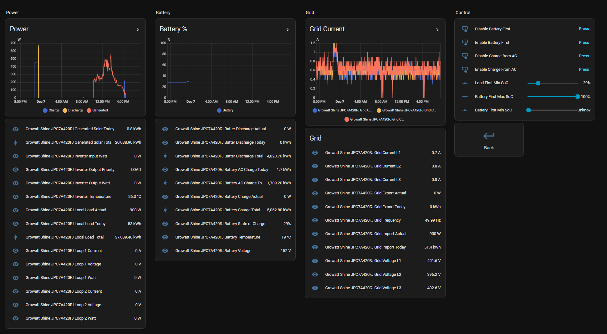

# Growatt2mqtt

This program accepts connections from a Growatt Inverter (Only tested with a single `SPH6000TL3 BH / 6KW`)

## Features

### No internet connection required

This services does not forward the date to Growatt servers, it takes over all communication with the inverter and all data is kept locally.

### Publish current state to MQTT

`growatttomqtt/status/<serial>/data`:

```json
{
  "pvstatus": 0,
  "pvpowerin": 0,
  "pv1Voltage": 0,
  "pv1Current": 0,
  "pv1Watt": 0,
  "pv2Voltage": 0,
  "pv2Current": 0,
  "pv2Watt": 0,
  "pvpowerout": 0,
  "pvfrequentie": 49.99,
  "pvgridvoltage": 402.1,
  "pvgridcurrent": 0.7,
  "pvgridpower": 0,
  "pvgridvoltage2": 396.5,
  "pvgridcurrent2": 0.7,
  "pvgridpower2": 0,
  "pvgridvoltage3": 402.7,
  "pvgridcurrent3": 0.7,
  "pvgridpower3": 0,
  "eactoday": 0,
  "pvenergytoday": 0.8,
  "pdischarge1": 0,
  "p1charge1": 0,
  "vbat": 152,
  "stateOfCharge": 29,
  "pactousertot": 750,
  "pactogridtot": 0,
  "batteryTemperature": 19,
  "pvtemperature": 26.3,
  "ts": 1765132315351,
  "eacharge_today": 1.7,
  "eacharge_total": 1709.2,
  "edischarge1_tod": 0,
  "edischarge1_total": 4823.7,
  "elocalload_tod": 53,
  "elocalload_tot": 37089.4,
  "plocaloadtot": 750,
  "etouser_tod": 51.5,
  "etouser_tot": 23930.9,
  "eactotal": 0,
  "outputPriority": "LOAD",
  "epvtotal": 20088.9,
  "eharge1_tod": 0,
  "eharge1_tot": 5062.8,
  "etogrid_tod": 0,
  "etogrid_tot": 6298.6
}
```

`growatttomqtt/status/<serial>/inverter-registers`:

```json
{
  "registers": {
    "1044": { "rawValue": 0, "name": "Priority" },
    "1091": { "rawValue": 100, "name": "BatteryFirstChargeStopSoC" },
    "1092": { "rawValue": 0, "name": "BatteryFirstAcCharge" },
    "122": { "rawValue": 0, "name": "ExportLimitEnableDisable" },
    "123": { "rawValue": 0, "name": "ExportLimitPowerRate" },
    "1010": {
      "rawValue": 700,
      "name": "BatteryUpperTemperatureLimitForDischarge"
    },
    "608": { "rawValue": 29, "name": "LoadFirstDischargeStopSoC" },
    "1102": { "rawValue": 0, "name": "BatteryFirst1Enabled" },
    "1101": { "rawValue": 5947, "name": "BatteryFirst1Stop" }
  }
}
```

### Home Assistant MQTT Discovery

Makes the current status available automatically through the Home Assistant user interface:



### Prometheus Metric Endpoint

It has a prometheus metrics endpoint at `/metrics`

### Health Endpoint

It has a health endpoint at `/health`

## How to deploy

The application is distributed using a docker image available at [jonasmh/growatt2mqtt](https://hub.docker.com/r/jonasmh/growatt2mqtt)

It is based on a `alpine` base image with only

- A single package installed `tzdata` (Timezone information)
- The Growatt2Mqtt services

All thanks to C#'s AOT compilation feature. This also means the entire image only takes up ~12 MBytes compressed

### Docker Compose

Example docker-compose:

```yaml
services:
  growatt2mqtt:
    image: jonasmh/growatt2mqtt:latest
    environment:
      - MqttConnection__Server=192.168.0.30
      - MqttConnection__Port=1883
      - MqttConnection__UseTls=false
    ports:
      - 5279:5279
```

### Configuration

| Json Key                                | Environment Varible                       | Description                                                          | Example                             | Default                                |
| --------------------------------------- | ----------------------------------------- | -------------------------------------------------------------------- | ----------------------------------- | -------------------------------------- |
| `GrowattToMqtt.InverterRegistersToRead` | `GrowattToMqtt__InverterRegistersToRead`, | Arrays of inverters registers to periodically read an make available | `[1044,1091,1092,122,123,1010,608]` | `[]`                                   |
| `GrowattServer.Port`                    | `GrowattServer__Port`                     | Port the server accepts incomming Growatt requests on                | `5279`                              | `5279`                                 |
| `GrowattServer.HostingAddress`          | `GrowattServer__HostingAddress`           | What addresses to host on                                            | `192.168.1.0`                       | `0.0.0.0` (All interfaces)             |
| `MqttConnection.Server`                 | `MqttConnection__Server`,                 | Server address of the MQTT Server                                    | `192.168.1.42`                      | `mosquitto`                            |
| `MqttConnection.Port`                   | `MqttConnection__Port`,                   | Port to connect to the MQTT Server with                              | `8883`                              | `8883`                                 |
| `MqttConnection.UseTls`                 | `MqttConnection__UseTls`,                 | Use TLS to connect                                                   | `true`/`false`                      | `true`                                 |
| `MqttConnection.CaCrt`                  | `MqttConnection__CaCrt`,                  | CA Certificate                                                       | `ca.crt`                            | `/data/mosquitto-client-certs/ca.crt`  |
| `MqttConnection.ClientCrt`              | `MqttConnection__ClientCrt`,              | Client Certificate                                                   | `tls.crt`                           | `/data/mosquitto-client-certs/tls.crt` |
| `MqttConnection.ClientKey`              | `MqttConnection__ClientKey`,              | Client Key                                                           | `tls.key`                           | `/data/mosquitto-client-certs/tls.key` |

## Configure inverter

You must configure the Growatt Shine WiFi dongle to publish to above endpoint.
